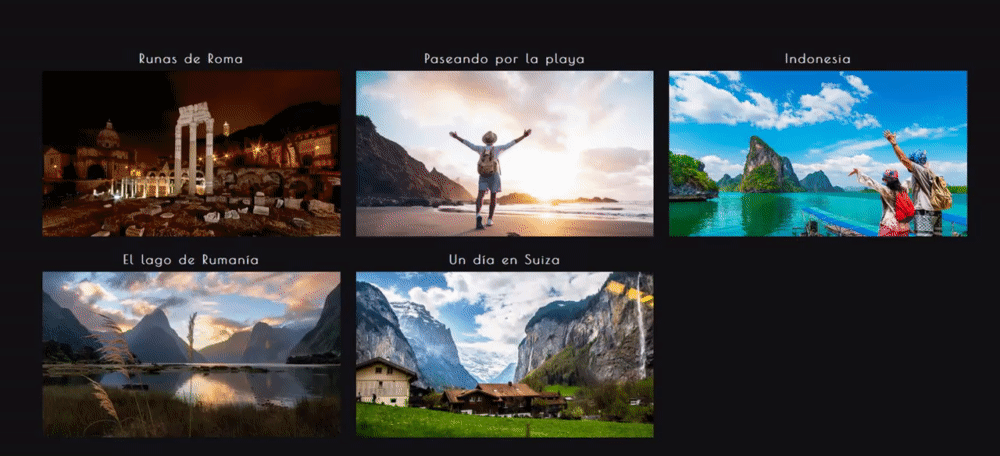
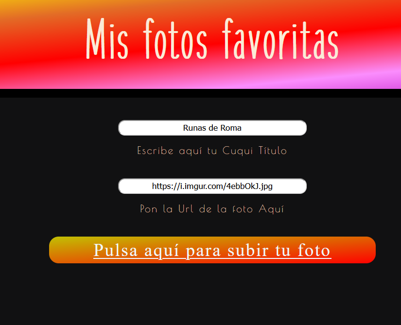
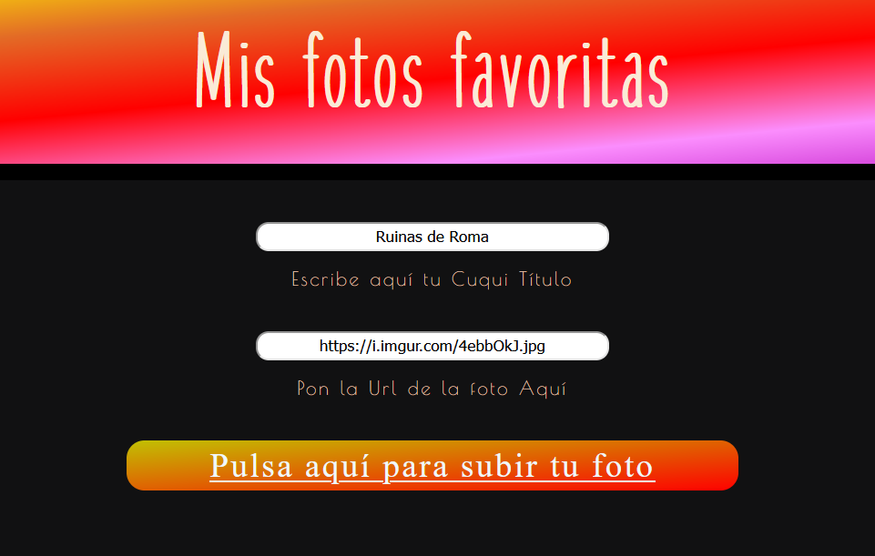
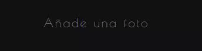
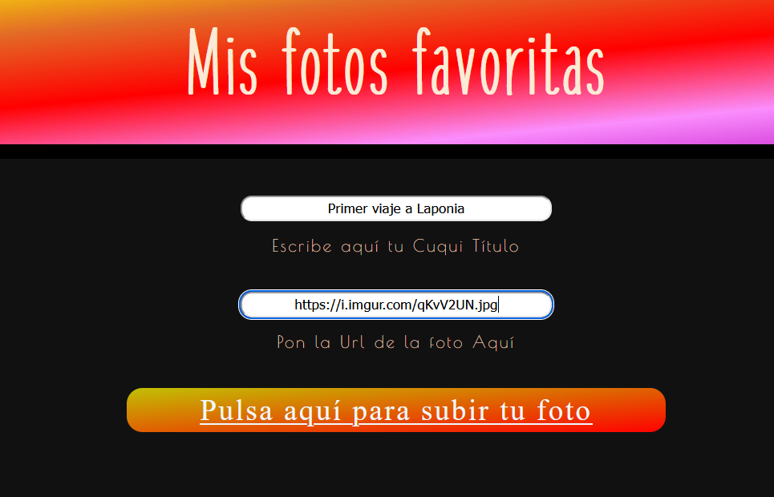
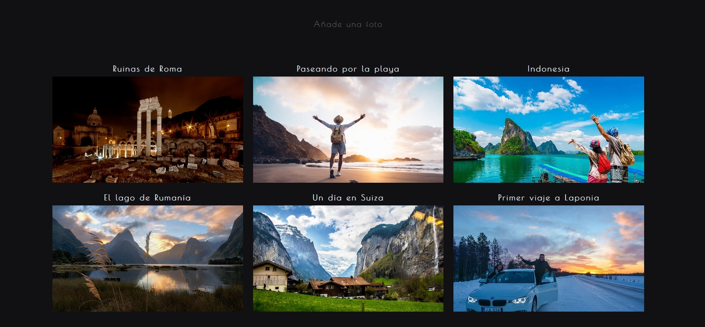
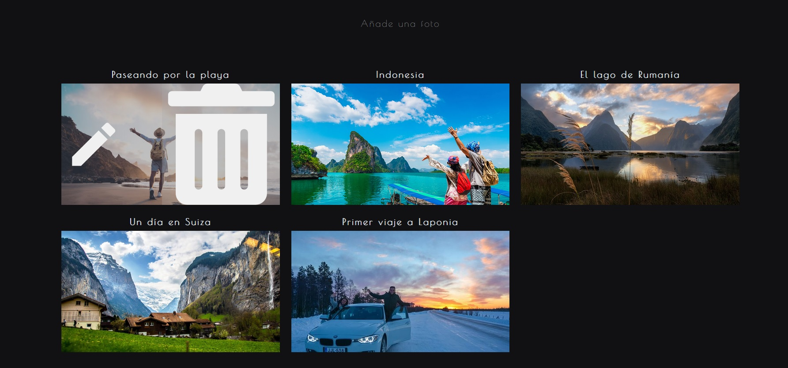
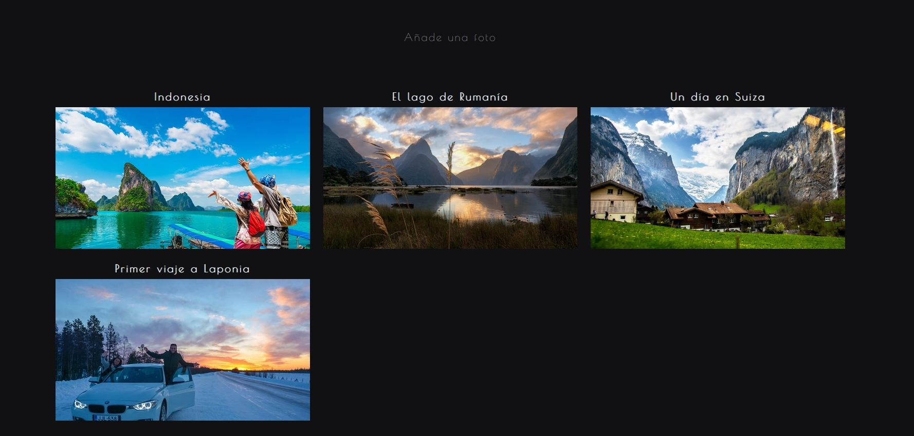
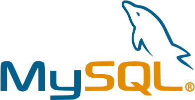

## Mis Imagenes Favoritas

<ul>
        <li>Descripción del Proyecto</li>
        <li>Desarrollo</li>
        <li>Presentación</li>
        <li>Stacks utilizados</li>
        <li>Como instalarlo</li>
</ul>

## 📝 1. Descripción del Proyecto

En esta prueba técnica se pide ver una lista de imágenes con su título y poder añadir, borrar y editar esa lista. Además para ello pedían que los datos se guardaran en una base de datos, en este caso he elegido mySQL. 

La prueba técnica está dividida en dos carpetas: 

1. Front; donde se ha utilizado la biblioteca de ReactJS para consumir la API y dar funcionalidad a las peticiones. Además, desde el front podemos observar que tenemos dos vistas, la principal y la del formulario. La estructura utilizada es el Atomic Design. 

2. Back; donde se ha utilizado el framework de Java, Spring boot, y una base relacional tipo sql, mySQL. Allí es donde se crea la clase CImage, la cual consta de dos strings, title y url. Todas las funcionalidades del CRUD están implementadas mediante JPA, como se puede observar en el código en la sección Interfaces. La estructura que sigue es la de MVC.

Todo ello apoyado con una cobertura de test basados en TDD. Desde el front utilizamos Jest, que viene integrado por defecto en ReactJS, y en el back JUnit.

## ✏️ 2. Desarrollo

Se comenzó a montar la idea de la prueba en figma de manera muy simple. Una vez sabía qué era lo que quería mostrar y cómo, busqué ejemplos de redes sociales de imágenes para inspirarme en sus colores principales. Cuando ya estaba todo estructurado y sabía que era lo que quería mostar a nivel visual, comencé a organizar el front en componentes, servicios y vistas. Más tarde comencé con el proceso TDD comprobando en todos los componentes que todos eran una función, para luego crear la función en si. Así fuí desarrollando, poco a poco, lo que sería el front. Cuando lo básico estaba programado, comencé con el back, donde, siguiendo el criterio MVC, realicé el CRUD con un soporte de test del 100%.
Una vez la API fue funcional y el front la consumía sin problemas, fui mejorando los estilos, incorporando el tipo de letra y, en definitiva, todo los relacionado con UI/UX 

## 🧑‍💻 3. Presentación

Aquí dejo la presentación del proyecto en capturas y gifs que muestran tanto la funcionalidad como el aspecto de la misma.

<h4>Aplicación Web</h4>


<h4>Editar</h4>





<h4>Guardar</h4>




<h4>Borrar</h4>




## 🔧 4. Stacks

<a href="https://www.w3.org/html/" target="_blank" rel="noreferrer">  </a>
<a href="https://www.w3.org/html/" target="_blank" rel="noreferrer">  </a>
<a href="https://developer.mozilla.org/es/docs/Web/JavaScript" target="_blank" rel="noreferrer">  </a>
<a href="https://react.dev" target="_blank" rel="noreferrer">  </a>

<a href="https://www.mysql.com" target="_blank" rel="noreferrer">  </a>
<a href="https://www.java.com/es/" target="_blank" rel="noreferrer">  </a>
<a href="https://spring.io/projects/spring-boot" target="_blank" rel="noreferrer">  </a>

<a href="https://code.visualstudio.com" target="_blank" rel="noreferrer">  </a>
<a href="https://www.jetbrains.com/idea/" target="_blank" rel="noreferrer">  </a>

<a href="https://www.postman.com" target="_blank" rel="noreferrer">  </a> 

<a href="https://www.figma.com" target="_blank" rel="noreferrer">  </a>

<a href="https://git-scm.com" target="_blank" rel="noreferrer">  </a>
<a href="https://github.com" target="_blank" rel="noreferrer">  </a>

## 💻 5. Cómo instalar el proyecto

IDEs:

<a href="https://code.visualstudio.com" target="_blank" rel="noreferrer">  </a>
<a href="https://www.jetbrains.com/idea/" target="_blank" rel="noreferrer">  </a>
<a href="https://www.mysql.com/products/workbench/" target="_blank" rel="noreferrer">  </a>

BACK-END

1. Clonar el proyecto
```bash
git https://github.com/ChristianCarbajo/misImagenesFavoritas.git
```
2. Activar el servidor y dejar el terminal abierto
```bash
cd back
```
3. Activar el servidor y dejar el terminal abierto
```bash
Situarse en el archivo BackClubAtletismoVillaviciosaApplication.java y clicar Run (Shift + F10)
```

FRONT-END
1. Clonar el proyecto
```bash
git https://github.com/ChristianCarbajo/misImagenesFavoritas.git
```

2. Acceder a la carpeta del proyecto
```bash
cd front
```

3. Instalar dependencias
```bash
npm install
```

4. Activar el servidor y guardar el terminal abierto
```bash
npm start
```   
En caso de que de un error de falta de scripts, poner este comando npm install react-scripts --save
```bash
npm install react-scripts --save
```  


